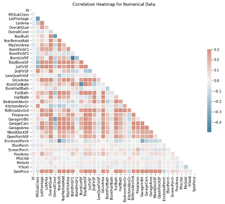

# Predicting House Prices with Machine Learning

## Team Members
- Roberts Kustavus (519 Yang’s cohort)
- Yueqi Wu (419 Pooja’s cohort)
- Zhanqi Wang (519 Yang’s cohort)

## Project Mentor
- Pooja

## Abstract
We developed a model to predict house prices based on house features to facilitate easier purchasing and research in the real estate market. We first ran linear models (Lasso, Ridge, Linear regression) on the original and PCA/log-transformed dataset. Then, we ran non-linear models and constructed an ensemble by stacking these models to improve generalization performance. Our final model achieved a test RMSE of $24644. We also ran classification models on the dataset with labeled house price levels.

## Introduction
Real estate prices affect people’s daily lives. Buyers are concerned about whether the price of a house can be justified by its attributes and whether the sale price reflects the dynamics in the housing market. Policymakers are also concerned about how their urban policies would affect house prices and affordability. This problem, being part of an established Kaggle challenge, allowed us to learn and gain practice in machine learning while being able to gauge our results in the context of other participants.

## Related Prior Work
Kaggle challenge: our exploration is grounded in the Kaggle House Prices - Advanced Regression Techniques challenge. It is based on the Ames Housing dataset[1] which we will use as the main data for training and testing our models. Currently 6780 teams have joined the competition.[2]  We did a survey of notebooks in the code section of the challenge and the dataset [3]. Many of the notebooks that did not use an ensemble of different models used normalized linear regression and random forests regression and used hand selected features[4-11]. Notebooks containing ensembles usually consisted of L1, L2 regularized linear regression, Gradient Boosting regression, XGBoost and some other model depending on the notebook.[12-18]. From the notebooks we reviewed only one used SVR as a part of their ensemble and in that one the ensemble weights were applied manually [12], so we want to explore the use of support vector machines further.

Ames Housing Dataset and stacking: Outside of the posts on Kaggle we also reviewed some academic work on the topic. There is a vast body of work in the field of machine learning that is based on the Ames Housing dataset. We focused on articles that relate to ensemble learning and advanced regression. Shahhosseini, Hu and Pham [19] tune parameters for an ensemble of L1 regression, Random forests, Neural Network, XGBoostand SVM on both the Ames dataset and Boston housing dataset and by finding optimal weights gain MSE of 0.0126. But the optimization they reach is specific to the set of models they have chosen. Additionally, research also shows that ensemble scores can be improved by adding a residual regressor [20].

## Formal Problem Setup (T E P)
- **T**: Predict house prices using a predictor \( f_\theta(x) \) to estimate the sales price of houses with attributes vector \( x \).
- **E**: The Ames Housing dataset contains 80 features and 1460 instances. We split 20% of the data for initial testing and performed 5-fold cross-validation in later tests.
- **P**: Mean squared error was used as part of our performance evaluation metrics. RMSE was calculated to compare the results of linear and non-linear regression models.

## Methods
The dataset contains 80 features. We used a correlation heatmap to explore the relationship between various features and sale price. We trained several models to address overfitting and improve prediction accuracy:
- Linear Models: We employed linear regression, Ridge, and Lasso regression, with PCA and log transformation.
- Non-linear Models: We used Support Vector Regression, Random Forest Regression, MLP Regression, and Gradient Boosting Regression.
- Ensemble Model: We created a stacking ensemble model combining the predictions of previous models.

## Experimental Results
### Linear Models
| Method | Training RMSE | Test RMSE |
|--------|----------------|-----------|
| Linear Regression | 21141.58 | 190212133572100 |
| Ridge Regression (λ=4.99) | 21159.48 | 29365.55 |
| Lasso Regression (λ=0.25) | 21141.57 | 29346.49 |
| Log Transformed Linear Regression | 197183.07 | 47337528 |
| PCA Regression | 28818.64 | 36668.74 |
| PCA Regression with Log Transform | 24840.12 | 29331.92 |

### Non-linear Models
| Method | Training RMSE | Test RMSE |
|--------|----------------|-----------|
| Support Vector Regression (Tuned) | 28500.22 | 32979.62 |
| Random Forests Regression (Tuned) | 13766.40 | 28821.57 |
| MLP Regression (Tuned) | 7665.72 | 30091.99 |
| Gradient Boosting Regression (Tuned) | 11074.99 | 26755.02 |

### Ensemble Model
| Method | Training RMSE | Test RMSE |
|--------|----------------|-----------|
| Ensemble of tuned models (GBR, RF, L1Lin, L2Lin, Lin) | 5949.31 | 24644.66 |

### Classification Models
| Method | Testing Accuracy |
|--------|------------------|
| SVM - Linear Kernel | 0.8425 |
| SVM - Polynomial Kernel | 0.5 |
| SVM - Radial Basis Kernel | 0.4897 |
| SVM - Sigmoid Kernel | 0.4384 |
| Random Forest | 0.8425 |

## Conclusions and Future Work
We found that feature selection methods like PCA and Lasso regression improve generalization performance. Our ensemble model achieved the lowest test errors, but further work is needed to reduce the error rate. Future work includes optimizing hyperparameters and exploring different model combinations. For classification models, incorporating demographic information and resident income could provide more useful insights for policymakers.

## Ethical Considerations and Broader Impacts
While machine learning promotes pricing transparency, proxy features could lead to gentrification and other social impacts. Our model should be used as a tool to supplement expert judgment, considering its implications on city tax planning and neighborhood budgets.

## References
- [De Cock, D. (2011). Ames, Iowa: Alternative to the Boston housing data as an end of semester regression project. Journal of Statistics Education, 19(3).](https://jse.amstat.org/v19n3/decock.pdf)
- [Kaggle House Prices - Advanced Regression Techniques challenge](https://www.kaggle.com/c/house-prices-advanced-regression-techniques/overview)
- Various Kaggle notebooks and academic articles.

